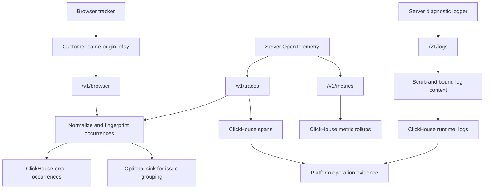

## Signal flow



The `/v1/logs` path requires the operation-logging deployment. See
[capability checks](/runtime/operation-logging#check-your-installation).

The ingester is **stateless**: auth key → `{orgId, repositoryId}` resolution, normalization, fingerprinting, ClickHouse writes, optional forward. Anything stateful (issue lifecycle, incidents, correlation, symbolication) belongs to the consumer of the sink webhook (Autter cloud, or your own backend).

## External provider sources

[Repository connectors](/runtime/external-sources) use a separate platform collection path: provider API or webhook → stored normalized occurrence in the organization database → Runtime issue → RCA → eligible draft-fix queue. They do not pass through this repository's OTLP ingester or require its ClickHouse tables. The collector and analysis workers run independently of API replicas. Source identity includes repository ownership, service/environment and provider fingerprint.

The new connector webhook acknowledges delivery after durable storage. This confirms ingestion, while RCA and PR generation remain asynchronous. SDK sink and legacy webhook paths have their own delivery contracts.

## Tenancy & key scopes

Every ClickHouse row is keyed by `(org_id, repository_id)` and every query must filter on both. One repository is one unit of analysis; the ingest key carries the mapping, so a key is scoped to exactly one repo.

Two key scopes separate frontend and backend credentials:

- **Server keys** (`autter_rt_…`, secret) — backends only, for OTLP endpoints and as the relay's forwarding key. Sent as a bearer header.
- **Client keys** (`autter_rtc_…`, publishable) — shipped in frontend bundles for direct browser ingest. Restricted to `/v1/browser`, enforced against a per-key origin allow-list, tighter rate limits, and carried as a `?key=` query param because `sendBeacon` cannot set headers. A leaked client key can at worst submit fake browser events for one repo — it can never read data or send OTLP.

## ClickHouse tables

| Table | Engine | Order by | TTL |
| --- | --- | --- | --- |
| `runtime_error_occurrences` | MergeTree | `(org_id, repository_id, fingerprint, occurred_at)` | 14 d |
| `runtime_spans` | MergeTree | `(org_id, repository_id, trace_id, started_at)` | 7 d |
| `runtime_logs` | ReplacingMergeTree | `(org_id, repository_id, occurred_at, event_id)` | 14 d in the operation-logging schema |
| `runtime_metrics_1m` | SummingMergeTree | `(org_id, repository_id, service, environment, release, route, bucket_at)` | 90 d |

`runtime_metrics_1m` is pre-aggregated per minute; readers must `SUM(...) GROUP BY` because SummingMergeTree collapses rows at merge time, eventually. Percentiles come from sampled spans at query time — the rollup table stores only counts and duration sums.

### Occurrences are aggregation-ready at write time

`runtime_error_occurrences` holds captured errors **and intentional issue-producing** warnings/info (`severity` column: `fatal | error | warning | info`). Ordinary diagnostic messages use the separate `runtime_logs` table. Alongside the raw occurrence fields, the ingester stores derived columns computed by the same normalizers the fingerprint hashes, so aggregations never re-parse stacks or routes in SQL:

| Column | Derivation | Aggregation use |
| --- | --- | --- |
| `fingerprint` | hash of source+service+type+normalized message+top frames+normalized route | the issue group key |
| `severity` | SDK-declared (`autter.severity`); `autter.unhandled` ⇒ `fatal` | errors vs. warnings, alert thresholds |
| `message_normalized` | ids/numbers/quoted strings templated out | "what is this group" label |
| `route_normalized` | `/users/8812` → `/users/:id` | errors-by-endpoint, low-cardinality |
| `top_frames` (Array) | top ≤5 normalized stack frames | "point of error" drill-down |
| `first_frame` | `top_frames[1]` | single-column GROUP BY for hotspot files |
| `method` | `http.request.method` | split GET vs. POST failures |

Severity is deliberately **not** part of the fingerprint: the same defect reported as a warning in one code path and an error in another stays one group.

Retention philosophy: raw signal is short-lived; anything worth keeping long-term (issue summaries, incident history, learnings) is derived and stored by the sink consumer.

<Note>
  **Schema evolution:** the ingester migrates the database itself at boot — baseline `CREATE IF NOT EXISTS` for fresh databases plus versioned, idempotent migrations tracked in `<db>.schema_migrations` for existing ones. Deploying a new ingester version *is* the schema deployment. Readers (dashboards, the Autter backend) should treat columns as additive-only within a major version.
</Note>

## Fingerprinting

`sha256(source + service + error_type + normalised_message + top_5_frames + normalised_route)`, truncated to 32 hex chars.

- Message normalization: quoted strings → `<str>`, UUIDs → `<uuid>`, long hex → `<hex>`, numbers → `<n>`.
- Frame normalization is **language-aware**. Each supported runtime's native stack format is parsed and every frame reduced to a stable `function (file)` token — JavaScript/TypeScript, Python, Go, Rust, JVM (Java, Kotlin, Scala), and .NET. Volatile parts are stripped (line and column numbers, `+0x` offsets, pointer arguments, memory addresses), because they shift on every deploy while the function and file stay stable.
- Route normalization: id-like path segments → `:id` (`/orders/812` → `/orders/:id`).

Parsing the native format per language is what keeps unrelated defects apart: two errors from different functions or files never merge just because their messages match, and the same defect keeps one fingerprint across re-deploys. An unrecognized but still frame-shaped stack falls back to a templated signature rather than being discarded — discarding frames is what would collapse every same-message error into one issue. A stack with no frame-like lines contributes nothing, and grouping falls back to source + service + error type + message.

The fingerprint is computed once at ingest, and the Autter backend groups on it — so browser-relay, JavaScript/Node OTLP, and native Go, Rust, Java, .NET, and Python occurrences all group identically.

## OTLP mapping (traces)

Resource attributes:

| OTel attribute | Field |
| --- | --- |
| `service.name` | `service` |
| `deployment.environment` / `deployment.environment.name` | `environment` |
| `service.version` | `release` |

Span-level:

- Error occurrence emitted when span status is `ERROR`, or per `exception` event (`exception.type`, `exception.message`, `exception.stacktrace`).
- `route` from `http.route`, falling back to `url.path` / `http.target` (query-stripped).
- `status_code` from `http.response.status_code` / `http.status_code`.
- Server spans aggregate into 1-minute usage rollups: `request_count`, `error_count` (status ≥ 500 or span error), `duration_sum_ms`.

## OTLP mapping (logs)

`POST /v1/logs` accepts authenticated server OTLP JSON/protobuf and stores
diagnostic messages separately from issues. Resource attributes supply service,
environment and release; tenant/repository identity comes from the validated
ingest key. Record fields carry trace/span IDs, severity, body and timestamp.
Bounded scrubbed attributes retain nested context and operation metadata.

Completed summaries use `autter.event.type=operation` plus operation ID/name,
outcome, elapsed duration and measured steps. See the [attribute contract](/runtime/operation-logging#other-languages-and-existing-otlp-loggers).
An error-severity log or failed summary does not itself emit an error occurrence.
Node's operation helper also reports thrown exceptions or a declared failed
`autter.outcome` through tracing, which retains the existing grouping path.

Platform evidence queries link captured occurrence trace/operation IDs to logs
and spans, rather than nearby timestamps. They retrieve bounded occurrence
samples and matching successful operations by name/service/environment/release.
Truncated samples and unavailable sources remain explicit. Logs and traces can
arrive separately, so a saved analysis snapshot may predate later evidence.
See [logging verification](/runtime/operation-logging#verify-stored-logs-and-failure-evidence).

## Browser payload (v1)

```json
{
  "version": 1,
  "sessionId": "s_48ba12",
  "service": "web-app",
  "environment": "production",
  "release": "e4a218f",
  "events": [
    {
      "type": "exception",
      "timestamp": "2026-07-21T11:22:00Z",
      "message": "Cannot read properties of undefined",
      "stack": "TypeError: ...",
      "filename": "/assets/checkout.js",
      "line": 127,
      "column": 18,
      "route": "/checkout"
    }
  ]
}
```

Event types: `exception`, `unhandled_rejection`, `session_start`, and `track_event` (carries a `name`; counted into `runtime_metrics_1m` as `request_count` on the synthetic route `event:<name>` — coarse usage counters, not an analytics event store).

Forbidden at the schema level (rejected/stripped): full URLs with query strings, cookies, DOM content, form values, request headers/bodies, emails.

## Sink webhook (v1)

When `AUTTER_SINK_URL` is set, each ingest batch POSTs:

```json
{
  "version": 1,
  "orgId": "...",
  "repositoryId": "...",
  "occurrences": [
    {
      "occurrenceId": "...",
      "fingerprint": "...",
      "source": "server",
      "service": "payments-api",
      "environment": "production",
      "release": "e4a218f",
      "errorType": "TypeError",
      "message": "...",
      "stack": "...",
      "route": "/orders/:id",
      "statusCode": 500,
      "traceId": "...",
      "sessionId": "",
      "occurredAt": "2026-07-21T11:22:00.123Z"
    }
  ]
}
```

Delivery is best-effort fire-and-forget (the ingester is not a queue); the consumer should treat ClickHouse as the recovery source for missed batches.
