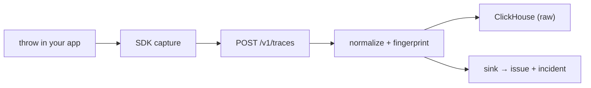

This page traces a single Node.js exception through the whole pipeline, so you know exactly what each stage does and where to look when something surprises you.



## The example

A payments service is instrumented with the preloaded `instrument.cjs` from the [quickstart](/runtime/quickstart):

```js
// instrument.cjs — preloaded via: node --require ./instrument.cjs server.js
const { initAutterServer } = require("@autter/runtime-node");

initAutterServer({
  apiKey: process.env.AUTTER_RUNTIME_KEY,
  service: "payments-api",
  environment: "production",
  release: process.env.GIT_SHA,
});
```

One route has a bug — a lookup can return `undefined`:

```js
app.post("/orders/:id/charge", async (req, res) => {
  const order = await orders.find(req.params.id);
  await chargeCard(order.card); // order is undefined → TypeError
  res.json({ ok: true });
});
```

A request for a deleted order throws `TypeError: Cannot read properties of undefined (reading 'card')`.

## 1. Capture, in your process

Two paths lead into the same pipeline:

- **Handled errors** — you call `captureException(err, attributes)`. The SDK records the error as a span named after the error type, with the stack trace, `autter.severity: "error"`, and any attributes you pass (`{ "order.id": order.id }` becomes queryable metadata).
- **Crashes** — the SDK observes unhandled exceptions with a monitor that does not change how your process exits. The error is reported with `autter.unhandled: true`, which the pipeline treats as `fatal` severity, and the SDK makes a best-effort flush before the process dies.

Your `service`, `environment`, and `release` are stamped once at init time and ride along on every event — you never repeat them per capture.

Errors do not compete with trace sampling. Regular request traces are sampled (about 1% by default); errors travel a dedicated always-on pipeline that batches for about two seconds and can never be sampled away.

## 2. Transport

The SDK sends OTLP/HTTP JSON to your ingester's `/v1/traces` endpoint, authenticated with the server key as a bearer header. If the ingester cannot write storage, it answers `503` instead of accepting and dropping — the exporter retries, so a storage hiccup delays data rather than losing it.

## 3. Ingest and normalize

The ingester resolves the key to one organization and repository, decodes the payload (JSON or protobuf), and walks the spans. Every exception event becomes one **occurrence**: source, severity, service, environment, release, error type, message, stack, and route. An errored span with no exception event still produces an occurrence, so failures never vanish just because nothing threw.

Normalization then strips the volatile parts and stores derived columns alongside the raw ones:

- the message is templated — ids, UUIDs, numbers, and quoted strings become placeholders
- the route collapses — `/orders/812/charge` becomes `/orders/:id/charge`
- the top stack frames keep file and function but drop line and column offsets, which shift on every minified deploy

## 4. Fingerprint — the grouping key

The ingester hashes source, service, error type, the normalized message, the top five normalized frames, and the normalized route into a 32-character fingerprint. The same `TypeError` from ten users, three releases, and two orders is one fingerprint; a different error type in the same route is a different one.

Severity is deliberately excluded: the same defect reported as a warning in one code path and an error in another stays one group. The full algorithm is in [Architecture & data model](/runtime/architecture#fingerprinting).

## 5. Storage

The occurrence lands as one row in `runtime_error_occurrences` in ClickHouse (raw errors, 14-day TTL). If the request's trace was sampled, its spans land in `runtime_spans`; per-minute usage rollups accumulate in `runtime_metrics_1m` regardless. This raw layer is what the quickstart's verification queries and the SQL explorer read. Raw signal is short-lived by design — everything worth keeping longer is derived downstream.

## 6. Issue and incident

The ingester forwards accepted batches to its sink — Autter's platform, or your own consumer if you self-host. Autter folds occurrences into an **issue** keyed by fingerprint plus service plus environment: total events, affected sessions, first and last seen, worst severity, and a sample stack. A resolved issue that recurs reopens automatically.

An issue escalates to an **incident** when it records a fatal crash or keeps recurring (ten or more occurrences). Autter then looks at successful deployments from the previous 48 hours, links the suspect pull request when the deployed commit matches one, writes a summary of the likely cause, and can open a fix pull request. The incident timeline records each step: detected, grouped, correlated, resolved.

## Where you see it

- **Runtime tab** in the Autter dashboard — issues list, incident detail with the timeline and any linked fix pull request, and the SQL explorer over the raw tables.
- **Locally** — the ClickHouse queries in the [quickstart](/runtime/quickstart) show occurrences seconds after a test error.

<CardGroup cols={2}>
  <Card title="Architecture & data model" icon="database" href="/runtime/architecture">
    The schema, TTLs, and normalization rules behind each stage.
  </Card>
  <Card title="Quickstart" icon="rocket" href="/runtime/quickstart">
    Instrument an app and trigger your first tracked exception.
  </Card>
</CardGroup>
