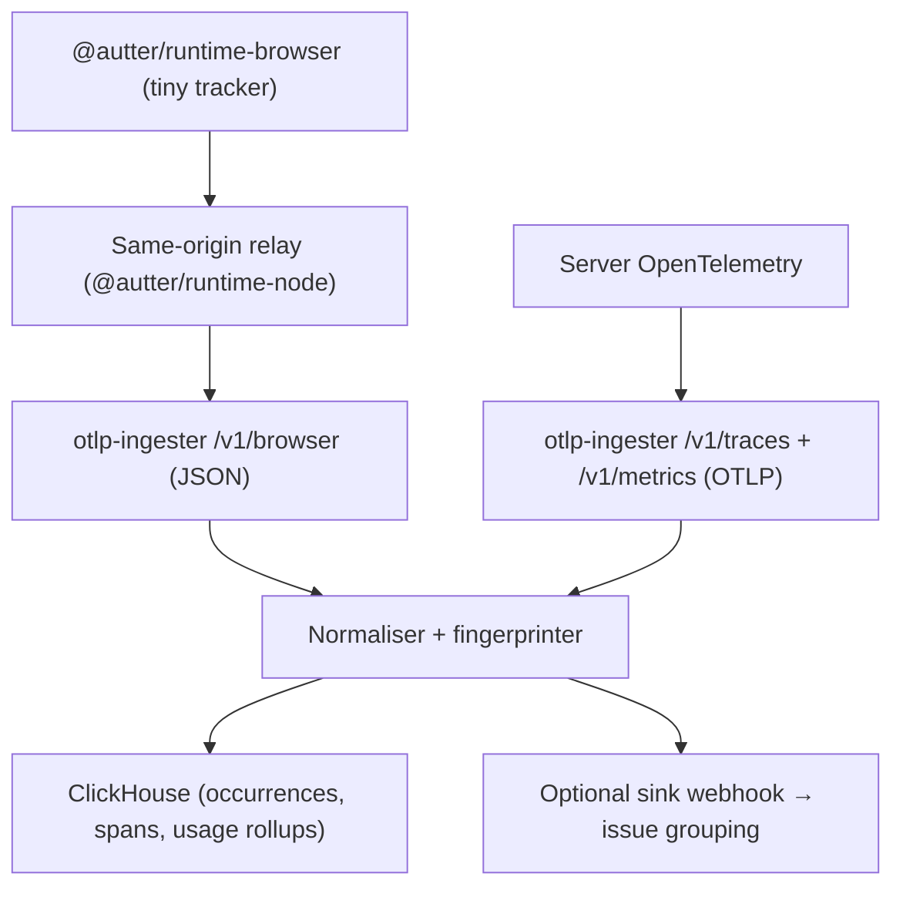

Autter Runtime tracks **runtime errors and usage** from your frontend and backend. It deliberately does not ship the full OpenTelemetry browser SDK to your users:

- the browser gets a dependency-free, **&lt;5 KB** error and usage tracker
- your server keeps real OpenTelemetry
- Autter Runtime's **OTLP ingester** receives both and writes them to ClickHouse in a compact, per-repository data model



<Tip>
  Fastest way to get set up — let a coding agent do it:

  ```bash
  npx skills add Autter-dev/autter-skills --all
  ```

  Then tell your agent: *"use the skills to install Autter Runtime in this
  project."* See [AI agent skills](/runtime/skills) for details.
</Tip>

<CardGroup cols={2}>
  <Card title="Quickstart" icon="rocket" href="/runtime/quickstart">
    Go from zero to seeing data in ClickHouse in a few minutes.
  </Card>
  <Card title="Installation" icon="download" href="/runtime/installation">
    Install the package for your stack — browser, Node, or Next.js.
  </Card>
</CardGroup>

## Packages

| Package | Description |
| --- | --- |
| [`@autter/runtime-browser`](https://github.com/Autter-dev/autter-runtime/tree/main/packages/runtime-browser) | Zero-dependency browser error + usage tracker (~1 KB brotlied) |
| [`@autter/runtime-node`](https://github.com/Autter-dev/autter-runtime/tree/main/packages/runtime-node) | Same-origin relay handler + curated OpenTelemetry server tracker |
| [`@autter/runtime-next`](https://github.com/Autter-dev/autter-runtime/tree/main/packages/runtime-next) | One-command Next.js integration (relay route + error boundary) |
| [`@autter/otlp-ingester`](https://github.com/Autter-dev/autter-runtime/tree/main/packages/otlp-ingester) | Self-hostable ingest service — OTLP/HTTP (protobuf + JSON) traces and metrics, plus browser payloads, into ClickHouse |

A runnable demo lives at [`examples/express-app`](https://github.com/Autter-dev/autter-runtime/tree/main/examples/express-app) — browser tracker → relay → ingester, and the OpenTelemetry server tracker, against a Docker Compose ClickHouse.

## Supported stacks

| Stack | How | Key type |
| --- | --- | --- |
| React / any SPA / static site | `@autter/runtime-browser` (direct) | client key (publishable) |
| React/SPA with a backend | `@autter/runtime-browser` → relay | none in browser; server key in relay |
| Next.js | `@autter/runtime-next` | server key |
| Node (Express, Fastify, Koa, Nest) | `@autter/runtime-node` | server key |
| Go, Rust, Python, Java, .NET, … | any OpenTelemetry SDK → OTLP/HTTP (protobuf or JSON) | server key |

See [Stack integrations](/runtime/integrations) for per-stack snippets, or [Using Autter Runtime without npm](/runtime/without-npm) if your service has no `@autter/*` package at all.

## Keys: frontend vs. backend

Two credential types keep the frontend and backend cleanly separated:

| | Server key (`autter_rt_…`) | Client key (`autter_rtc_…`) |
| --- | --- | --- |
| Secrecy | **secret** — backend env vars only | **publishable** — safe in frontend bundles |
| Can send | OTLP traces/metrics + browser events | browser events only |
| Protection | rate limits | origin allow-list + tighter rate limits, write-only |

<Tip>
  When your app has a backend, prefer the **relay**: the browser posts to your own server, which forwards with the server key. No key ever reaches the browser, and ad-blockers can't tell it apart from your own API traffic.
</Tip>

## Design principles

- **Errors are 100%, everything else is sampled or aggregated.** Raw error occurrences are always kept (14-day TTL); successful traces are expected to be sampled upstream (0.5–1%); usage is stored as 1-minute rollups (90 days).
- **Per-repository analysis.** Every row is keyed by `org_id` + `repository_id`.
- **Privacy by construction.** No cookies, no DOM, no request/response bodies, no emails, no full URLs with query strings.
- **OTLP-compatible at the ingestion layer**, not inside a 3 KB browser script.

Autter Runtime is open source under the MIT license: [Autter-dev/autter-runtime](https://github.com/Autter-dev/autter-runtime).
